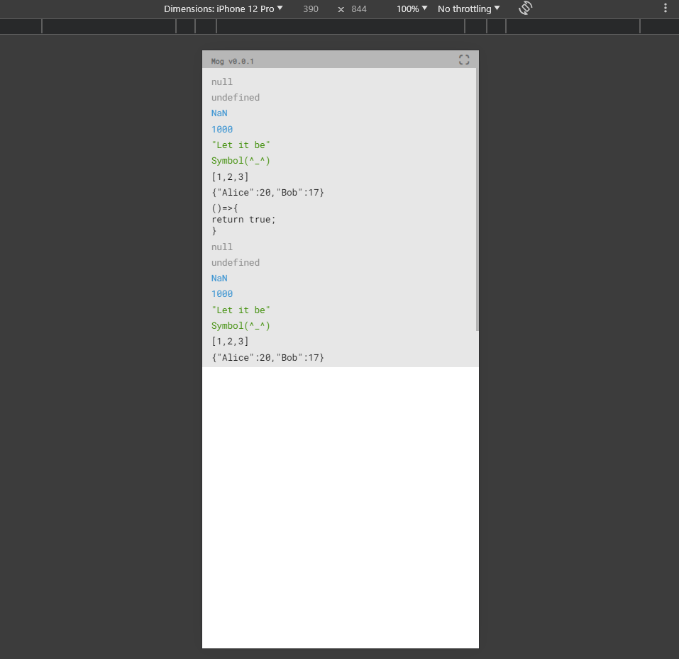

# How to use

Before you begin just copy Mog folder into your scripts folder.
Be careful: Mog show its output only for mobiles. Desktop user won't see any result

```ts
    import { Mog } from "./mog";

    // at first declare Mog singleton as var
    const mog = Mog.getSingle();
    
    // next init singleton passing your "host" html-element
    // to place output element of Mog
    mog.init({ 
        parentElement: document.getElementById("yourContainerId") 
    });
```

After that you can log anything what you want in two ways:

### Basic approach

U can use Mog in almost classic way (like `console.log`)

```ts
    mog.log("Lorem ipsum");
```

### Alias approach

But also you can "extract" log-function from Mog with `defineLog` method. Sure, you can make your own bind of this function, but this method make code much more pretty, cause you don't have to use `mog.log.bind(this)`

```ts
    import { LogFn } from "./mog/lib";

    const log: LogFn = mog.defineLog();
    
    // Such short wow
    log(420);
```

Also you have to know that method `mog.log` receive only 1 argument instead of classic `console.log`

## Appearance

It is how Mog looks like:



Debug panel sticks overtop on the same position. You are also able to collapse this panel